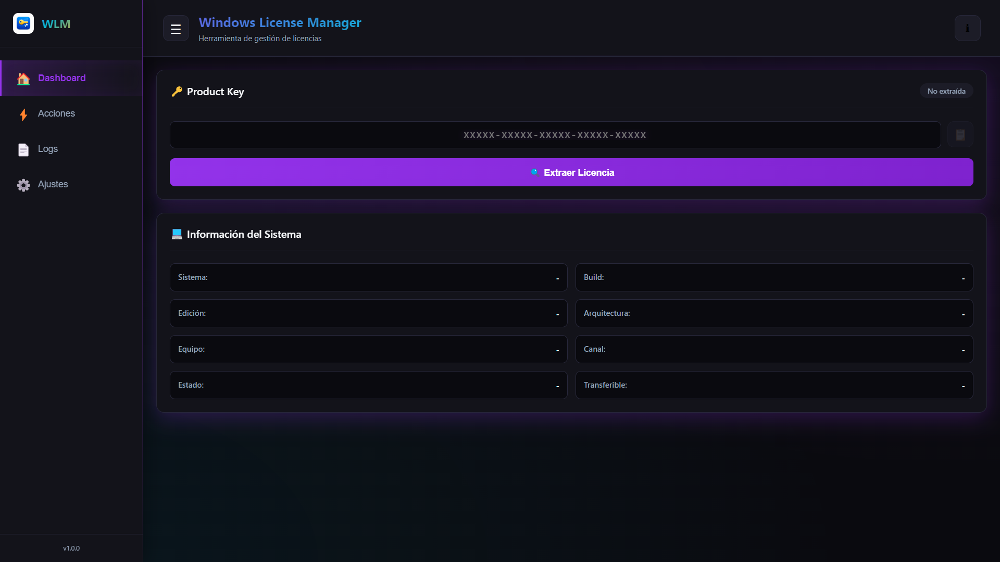
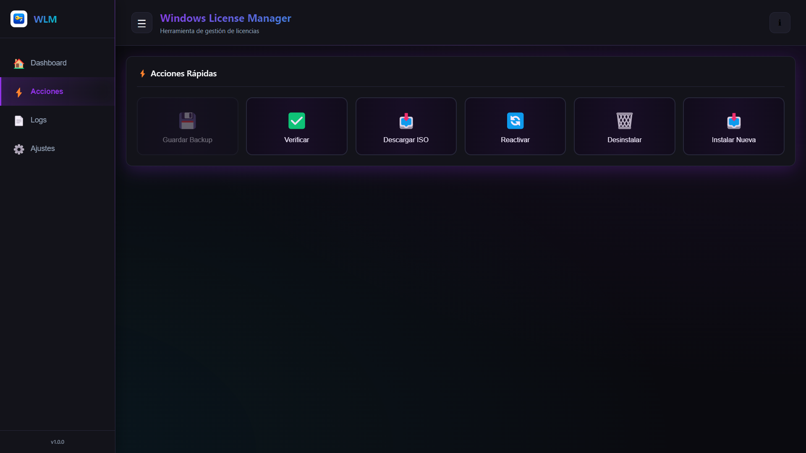
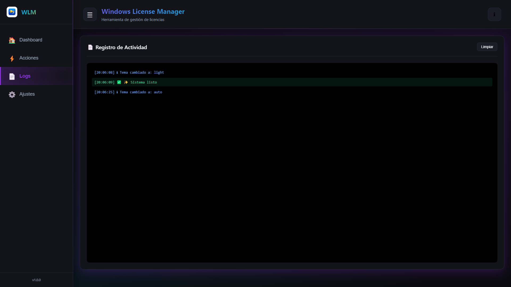
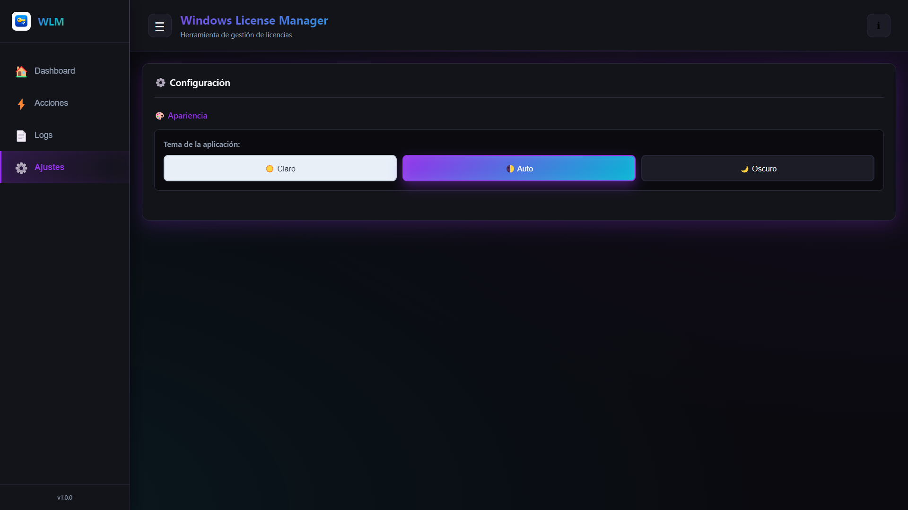

# 🔑 **Windows License Manager**

<p align="center">
  
  
  
  
</p>

<p align="center">
  <strong>✨ Herramienta profesional de gestión de licencias de Windows ✨</strong>
</p>

<p align="center">
  Extrae, gestiona y descarga ISOs oficiales de Windows con una interfaz moderna y elegante
</p>

---

## 📸 **Preview**

<p align="center">
  
   
   
   
</p>

---

## 🌟 **¿Qué es Windows License Manager?**

**Windows License Manager** es una aplicación de escritorio desarrollada con **Electron** que te permite gestionar de forma profesional las licencias de activación de Windows. Con una interfaz moderna estilo **Cyber Purple**, esta herramienta combina potencia y simplicidad para ofrecerte el control total sobre tu sistema operativo.

### **¿Para qué sirve?**

- 🔓 **Recuperar tu Product Key** si la has perdido
- 💾 **Hacer backup** de tu licencia antes de formatear
- 📥 **Descargar la ISO exacta** de tu versión de Windows
- 🔄 **Reactivar Windows** cuando tengas problemas de activación
- 🔐 **Cambiar de licencia** de forma segura
- 📊 **Ver información detallada** de tu sistema y licencia

---

## ✨ **Características Principales**

### 🔑 **Extracción Inteligente de Product Keys**

La aplicación utiliza **3 métodos avanzados** para extraer tu licencia de Windows:

1. **BIOS/UEFI** - Lee la clave embebida en tu placa madre (OEM)
2. **PowerShell** - Extrae claves usando WMI (Windows Management Instrumentation)
3. **Registry** - Busca en el registro de Windows claves de backup

**Soporta:**
- ✅ Windows 11 (todas las versiones)
- ✅ Windows 10 (todas las versiones)
- ✅ Licencias OEM (pre-instaladas)
- ✅ Licencias Retail (compradas independientemente)
- ✅ Licencias MAK y KMS (corporativas)

**Detecta automáticamente:**
- 🏷️ Si tu licencia es transferible o no
- 📌 El tipo de canal de licencia
- ✅ El estado de activación actual

---

### 🖥️ **Información Detallada del Sistema**

Obtén datos precisos sobre tu instalación de Windows:

- **Sistema Operativo**: Windows 11 Pro, Windows 10 Home, etc.
- **Versión de Marketing**: 22H2, 23H2, 24H2
- **Build Number**: 19045, 22621, 26100, etc.
- **Arquitectura**: 64-bit o 32-bit
- **Nombre del Equipo**: Identificación de tu PC
- **Estado de Licencia**: Activado, No activado, Período de gracia
- **Canal de Licencia**: Retail, OEM, Volume:MAK, Volume:GVLK

---

### 📥 **Descargador de ISOs Oficiales**

Una de las características más útiles: descarga la **ISO exacta** compatible con tu licencia.

**¿Por qué es importante?**
- Si formateas, necesitas la misma versión de Windows
- Tu Product Key solo funciona con la versión exacta (Build + Edición)
- Evitas errores de activación por incompatibilidad

**3 métodos de descarga:**

| Método | Descripción | Velocidad | Recomendado para |
|--------|-------------|-----------|------------------|
| 🏢 **Microsoft Oficial** | Descarga directa desde microsoft.com | ⚡⚡⚡ Rápida | Última versión estable |
| ⚡ **UUP Dump** | Build exacta de tu sistema actual | ⚡⚡ Media | Misma versión que tienes |
| 🛠️ **Media Creation Tool** | Herramienta oficial de Microsoft | ⚡⚡⚡ Rápida | Instalación en USB |

**Detección automática:**
- 🔍 La app detecta tu versión exacta (ej: Windows 11 23H2 Build 22631)
- 📊 Te muestra la arquitectura necesaria (x64)
- ⚠️ Te advierte si descargas una versión incompatible

---

### 💾 **Backup Profesional**

Exporta toda la información de tu licencia en un archivo `.txt` estructurado:

```
╔═══════════════════════════════════════════════════════════╗
║          WINDOWS LICENSE MANAGER - BACKUP                 ║
╚═══════════════════════════════════════════════════════════╝

📅 Fecha: 31/01/2026, 19:15:30

═══════════════════════════════════════════════════════════

🔑 PRODUCT KEY
─────────────────────────────────────────────────────────
XXXXX-XXXXX-XXXXX-XXXXX-XXXXX

📌 Método de Extracción: BIOS (WMIC)

═══════════════════════════════════════════════════════════

💻 INFORMACIÓN DEL SISTEMA
─────────────────────────────────────────────────────────
Sistema Operativo: Windows 11 Pro
Build: 22631
Edición: Pro
Arquitectura: 64-bit
Nombre del Equipo: DESKTOP-ABC123

═══════════════════════════════════════════════════════════

🔐 INFORMACIÓN DE LICENCIA
─────────────────────────────────────────────────────────
Estado: Licensed
Canal: Retail
Transferible: SÍ (Retail)

═══════════════════════════════════════════════════════════

Generado por Windows License Manager v1.0.0
```

**Puedes:**
- 📂 Guardarlo en múltiples ubicaciones (USB, nube, etc.)
- 📧 Enviártelo por email
- 🖨️ Imprimirlo para tenerlo físicamente

---

### 🔐 **Gestión Avanzada de Licencias**

**4 operaciones principales:**

#### 1️⃣ **Verificar Activación**
- Comprueba el estado actual de tu licencia
- Muestra fecha de expiración (si aplica)
- Indica si hay problemas de activación

#### 2️⃣ **Reactivar Windows**
- Intenta activar Windows automáticamente
- Útil cuando Windows se desactiva después de un cambio de hardware
- Usa el comando oficial `slmgr /ato`

#### 3️⃣ **Instalar Nueva Licencia**
- Introduce una nueva Product Key
- Aplica la licencia automáticamente
- Valida el formato antes de aplicar

#### 4️⃣ **Desinstalar Licencia**
- Elimina la licencia actual de forma segura
- Útil antes de vender tu PC
- Requiere confirmación para evitar errores

---

### 🎨 **Interfaz Moderna - Cyber Purple**

Diseñada con los estándares modernos de UI/UX:

- 🌙 **Tema oscuro optimizado** - Reduce fatiga visual
- 💜 **Paleta Cyber Purple** - Gradientes morados y cyan
- ✨ **Animaciones fluidas** - Experiencia premium
- 📊 **Sistema de logs en tiempo real** - Transparencia total
- 🔔 **Alertas elegantes** - Notificaciones con SweetAlert2
- 🖱️ **Botones intuitivos** - Iconos claros y descriptivos

---

### 🛡️ **Seguridad y Privacidad**

Tu seguridad es prioridad:

- ✅ **Verificación de permisos de administrador** - La app solo funciona con privilegios elevados
- ✅ **Sin telemetría** - No recopilamos ni enviamos datos
- ✅ **Sin conexiones externas** - Solo se conecta a internet para descargar ISOs (opcional)
- ✅ **Código local** - Todo se ejecuta en tu PC
- ✅ **No requiere cuenta** - No necesitas registrarte

---

## 🚀 **Descarga e Instalación**

### **📥 Descargar la última versión**

<p align="center">
  <a href="https://github.com/iscrodolfoalvarez/windows-license-manager/releases/latest">
    
  </a>
</p>

**Versión actual:** `v1.0.0` | **Tamaño:** ~150 MB | **Portable:** No requiere instalación

---

### **▶️ Cómo ejecutar**

1. **Descarga** el archivo `WindowsLicenseManager-v1.0.0-Portable.exe`
2. **Guárdalo** en cualquier carpeta de tu PC
3. **Clic derecho** sobre el archivo
4. Selecciona **"Ejecutar como administrador"**
5. Acepta el diálogo de **Control de Cuentas de Usuario (UAC)**
6. ✅ **¡Listo!** La aplicación se abrirá automáticamente

⚠️ **IMPORTANTE:** Si ejecutas sin permisos de administrador, verás una advertencia y la app se cerrará.

---

### **🖥️ Compatibilidad**

| Sistema Operativo | Soporte | Notas |
|-------------------|---------|-------|
| ✅ Windows 11 | Completo | Todas las versiones (21H2, 22H2, 23H2, 24H2) |
| ✅ Windows 10 | Completo | Todas las versiones (1809 a 22H2) |
| ⚠️ Windows 8.1 | Limitado | Funciones básicas |
| ⚠️ Windows 7 | Limitado | Algunas características pueden no funcionar |

**Requisitos mínimos:**
- 💻 Procesador: Intel/AMD 64-bit
- 🧠 RAM: 512 MB
- 💾 Espacio: 150 MB
- 🔐 Permisos: Administrador (obligatorio)

---

## 📖 **Guía de Uso Completa**

### **🔑 1. Extraer tu Product Key**

1. Ejecuta como administrador
2. Haz clic en **"Extraer Key"**
3. Espera la detección automática
4. Verás tu Product Key en pantalla

---

### **💾 2. Guardar Backup de tu Licencia**

1. Después de extraer la key, haz clic en **"Guardar Backup"**
2. Elige ubicación y nombre del archivo
3. Confirma y verifica el contenido

**💡 Consejo:** Guarda el backup en múltiples lugares (USB, nube)

---

### **📥 3. Descargar ISO de Windows**

1. Haz clic en **"Descargar ISO"**
2. Revisa la información detectada
3. Selecciona el método:
   - **Microsoft Oficial** (última versión)
   - **UUP Dump** (build exacta)
   - **Media Creation Tool** (USB booteable)
4. Sigue las instrucciones en el navegador

---

### **✅ 4. Verificar Activación**

1. Haz clic en **"Verificar"**
2. Espera 5-10 segundos
3. Verás el estado de tu licencia

---

### **🔄 5. Reactivar Windows**

1. Haz clic en **"Reactivar"**
2. Confirma la acción
3. Espera el proceso (requiere internet)

---

### **📥 6. Instalar Nueva Licencia**

1. Haz clic en **"Instalar Nueva"**
2. Introduce la Product Key (`XXXXX-XXXXX-XXXXX-XXXXX-XXXXX`)
3. Confirma y espera la aplicación

---

### **🗑️ 7. Desinstalar Licencia**

1. Haz clic en **"Desinstalar"** (botón rojo)
2. Lee la advertencia cuidadosamente
3. Confirma la acción

⚠️ **Advertencia:** Windows quedará sin licencia

---

## 🐛 **Solución de Problemas**

### **❌ "No se puede extraer la Product Key"**

**Causa:** Licencia digital vinculada a cuenta de Microsoft

**Solución:** 
- Verifica en **Configuración → Sistema → Activación**
- Si es licencia digital, está en tu cuenta de Microsoft

---

### **❌ "Requiere permisos de administrador"**

**Solución:**
- Clic derecho en el `.exe` → **"Ejecutar como administrador"**

---

### **❌ Windows Defender bloquea la descarga**

**Solución:**
- Haz clic en **"Más información"** → **"Ejecutar de todas formas"**
- Es un falso positivo común en apps nuevas sin firma digital

---

### **❌ Error al activar Windows**

**Soluciones:**
- Verifica tu conexión a internet
- Espera y vuelve a intentar
- Usa "Solucionar problemas" en Configuración de Windows
- Contacta a soporte de Microsoft para activación telefónica

---

## 💖 **Apoya el Proyecto**

Si **Windows License Manager** te fue útil, considera apoyar el desarrollo:

### **☕ Invítame un café**

<p align="center">
  <a href="https://www.paypal.me/rodolfoalvarez90">
    
  </a>
  <a href="https://buymeacoffee.com/rf0FXMaIKy">
    
  </a>
</p>

### **🌟 Otras formas de apoyar**

- ⭐ **Dale una estrella** a este repositorio
- 🐛 **Reporta bugs** en [Issues](https://github.com/iscrodolfoalvarez/windows-license-manager/issues)
- 💡 **Sugiere mejoras** en [Discussions](https://github.com/iscrodolfoalvarez/windows-license-manager/discussions)
- 📢 **Comparte** con tus amigos y en redes sociales
- 📺 **Suscríbete** a mi canal de YouTube [@RAA-TECH](https://www.youtube.com/@raa-tech)
- 📝 **Escribe una reseña** o haz un video tutorial

---

## 👨‍💻 **Sobre el Desarrollador**

<p align="center">
  
</p>

### **Rodolfo Álvarez (RAA-TECH)**

**Ingeniero en Sistemas Computacionales | Desarrollador Full Stack**

Soy Rodolfo Álvarez, Ingeniero en Sistemas Computacionales y desarrollador web apasionado por la tecnología. Me especializo en crear soluciones web funcionales, aplicaciones de escritorio con Electron y herramientas que facilitan el trabajo diario de los usuarios.

---

### **📬 Contacto y Colaboraciones**

<p align="center">
  <a href="mailto:rodolfoalvarezalvarez@gmail.com">
    
  </a>
</p>

**¿Tienes una idea de proyecto o quieres colaborar?**  
📧 Escríbeme a: **rodolfoalvarezalvarez@gmail.com**

---

### **🌐 Encuéntrame en:**

<p align="center">
  <a href="https://github.com/iscrodolfoalvarez">
    
  </a>
  <a href="https://www.youtube.com/@raa-tech">
    
  </a>
</p>

---

## 📜 **Licencia**

Este proyecto está bajo la **Licencia MIT** - consulta el archivo [LICENSE](LICENSE) para más detalles.

```
MIT License

Copyright (c) 2026 Rodolfo Álvarez

Permission is hereby granted, free of charge, to any person obtaining a copy
of this software and associated documentation files (the "Software"), to deal
in the Software without restriction, including without limitation the rights
to use, copy, modify, merge, publish, distribute, sublicense, and/or sell
copies of the Software, and to permit persons to whom the Software is
furnished to do so, subject to the following conditions:

The above copyright notice and this permission notice shall be included in all
copies or substantial portions of the Software.

THE SOFTWARE IS PROVIDED "AS IS", WITHOUT WARRANTY OF ANY KIND, EXPRESS OR
IMPLIED, INCLUDING BUT NOT LIMITED TO THE WARRANTIES OF MERCHANTABILITY,
FITNESS FOR A PARTICULAR PURPOSE AND NONINFRINGEMENT. IN NO EVENT SHALL THE
AUTHORS OR COPYRIGHT HOLDERS BE LIABLE FOR ANY CLAIM, DAMAGES OR OTHER
LIABILITY, WHETHER IN AN ACTION OF CONTRACT, TORT OR OTHERWISE, ARISING FROM,
OUT OF OR IN CONNECTION WITH THE SOFTWARE OR THE USE OR OTHER DEALINGS IN THE
SOFTWARE.
```

---

## 🙏 **Agradecimientos**

Este proyecto no sería posible sin:

- **[Electron](https://www.electronjs.org/)** - Framework principal
- **[Node.js](https://nodejs.org/)** - Runtime de JavaScript
- **[SweetAlert2](https://sweetalert2.github.io/)** - Alertas modernas
- **[UUP Dump](https://uupdump.net/)** - Descarga de builds de Windows
- **Microsoft** - Por las APIs de Windows Management
- **Comunidad Open Source** - Por el apoyo y feedback
- **Mis suscriptores de YouTube** - Por el apoyo constante

---

## 🗺️ **Roadmap - Próximas Versiones**

### **v1.1.0** (Próximamente)
- [ ] Soporte para Windows Server 2019/2022
- [ ] Exportar licencias en formato JSON
- [ ] Importar backups de licencias
- [ ] Modo oscuro/claro personalizable

### **v1.2.0**
- [ ] Historial de licencias instaladas
- [ ] Multi-idioma (Inglés, Español, Portugués)
- [ ] Verificación de autenticidad de Product Keys
- [ ] Actualización automática

### **v2.0.0**
- [ ] Integración con Microsoft Store
- [ ] Gestión de licencias de Office
- [ ] Interfaz web opcional
- [ ] Soporte para Linux (Wine)

---

## 📊 **Estadísticas**

<p align="center">
  
  
  
  
</p>

---

## 📢 **Comparte**

<p align="center">
  <a href="https://twitter.com/intent/tweet?text=¡Descubre%20Windows%20License%20Manager!%20Una%20herramienta%20profesional%20para%20gestionar%20licencias%20de%20Windows%20🔑✨&url=https://github.com/iscrodolfoalvarez/windows-license-manager">
    
  </a>
  <a href="https://www.facebook.com/sharer/sharer.php?u=https://github.com/iscrodolfoalvarez/windows-license-manager">
    
  </a>
  <a href="https://www.linkedin.com/sharing/share-offsite/?url=https://github.com/iscrodolfoalvarez/windows-license-manager">
    
  </a>
</p>

---

## ⭐ **Dale una estrella**

Si este proyecto te fue útil, ¡considera darle una estrella! ⭐

Ayuda a que más personas lo descubran.

---

<p align="center">
  
</p>

<p align="center">
  <strong>Hecho con 💜 por <a href="https://github.com/iscrodolfoalvarez">Rodolfo Álvarez (RAA-TECH)</a></strong>
</p>

<p align="center">
  <sub>Windows License Manager v1.0.0 - Professional License Management Tool</sub>
</p>

<p align="center">
  © 2026 Rodolfo Álvarez. Todos los derechos reservados.
</p>
